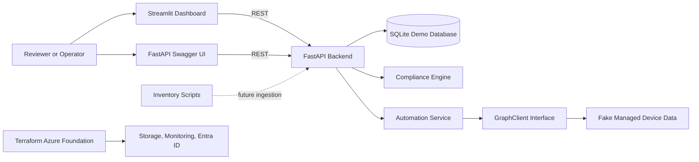

# Cloud Endpoint Automation Lab

A local-first portfolio project for Azure, Intune-style endpoint operations, cloud automation, and compliance reporting.

The project demonstrates how an internal IT/cloud automation engineer might design a small but production-minded service for endpoint inventory, policy checks, remediation recommendations, and Azure infrastructure planning. It runs completely in demo mode with fake device data, so no Microsoft Intune tenant or Microsoft Graph credentials are required.

## What This Demonstrates

- Python 3.12 FastAPI service design with typed schemas and clean route boundaries.
- Microsoft Graph/Intune-inspired client abstraction that can be replaced later.
- Endpoint compliance logic written as pure, tested functions.
- Local persistence with SQLite and deterministic seed data.
- Streamlit dashboard for fleet health, filtering, and action simulation.
- Read-only Linux and Windows inventory scripts that emit JSON.
- Docker Compose demo workflow for reviewers and interviewers.
- Terraform modules for low-cost Azure storage, monitoring, and Entra identity foundations.

## Architecture



The local application path is intentionally lightweight: dashboard to API, API to SQLite and service functions. The Azure Terraform path is included to show infrastructure thinking without making the demo depend on cloud resources.

## Local Quickstart

```bash
docker compose up --build
```

Open:

- Dashboard: http://localhost:8501
- API docs: http://localhost:8000/docs
- Health check: http://localhost:8000/health

The Compose file reads `.env.example` by default so the demo starts without extra setup. Create a local `.env` only if you want to override values.

## API Endpoints

| Method | Path | Purpose |
| --- | --- | --- |
| GET | `/health` | Service status, demo-mode flag, and timestamp |
| GET | `/devices` | Device inventory with current compliance state |
| GET | `/devices/{device_id}` | Single device lookup with 404 error response |
| GET | `/compliance/report` | Fleet summary, compliance percentage, and top failed rules |
| GET | `/compliance/devices` | Per-device compliance result and failed rules |
| POST | `/devices/{device_id}/sync` | Dry-run Intune-style device sync simulation |
| POST | `/devices/{device_id}/remediate` | Dry-run remediation recommendation simulation |

Errors use a consistent shape:

```json
{
  "status": "error",
  "message": "Device 'example' was not found."
}
```

## Dashboard

The Streamlit dashboard is built for quick operational review:

- Fleet compliance metrics.
- OS and compliance-state filters.
- Inventory table with failed rule details.
- Top failed rules chart.
- Dry-run sync and remediation actions.
- Clear demo-mode note so reviewers know no tenant is contacted.

## Compliance Rules

A device is compliant when:

- Disk encryption is enabled.
- Firewall is enabled.
- Patch status is `updated`.
- Last check-in is within 7 days.
- Windows devices also have antivirus enabled.

Linux devices do not fail compliance solely because antivirus is disabled, but they still require encryption, firewall, current patches, and recent check-in.

## Terraform

The Terraform code in `infra/azure` provisions a low-cost Azure foundation:

- Resource group
- Storage account
- Private blob container named `compliance-reports`
- Log Analytics Workspace
- Application Insights
- Entra ID application registration
- Service principal

```bash
cd infra/azure
cp terraform.tfvars.example terraform.tfvars
terraform init
terraform plan
```

Terraform requires Azure authentication. The local Docker demo does not.

## Common Commands

```bash
make up
make down
make test
make lint
make format
make terraform-init
make terraform-plan
```

## GitHub Actions

The repository includes a CI workflow at `.github/workflows/ci.yml` that validates the project like a deployment candidate:

- Backend linting and tests.
- Dashboard syntax check.
- Docker Compose configuration and image build.
- Terraform format, init, and validate.
- Simulated deployment summary artifact.

Branch-to-environment behavior:

| Branch | Environment | Terraform variables | Release channel |
| --- | --- | --- | --- |
| `develop` | `development` | `infra/azure/environments/development.tfvars` | `dev` |
| `main` | `production` | `infra/azure/environments/production.tfvars` | `stable` |

Pull requests run validation only. Pushes to `develop` or `main` run the simulated deployment job for the matching GitHub Environment. Manual workflow runs can choose either environment.

Main branch policy:

- Direct commits to `main` should be blocked with GitHub branch protection.
- Pull requests into `main` must come from `develop`.
- The `Main merge policy` workflow check fails any PR targeting `main` from another source branch.
- Detailed setup notes are in `docs/branch-protection.md`.

The workflow does not create Azure resources. A future production pipeline could add authenticated `terraform plan -var-file=...` and `terraform apply` stages using workload identity federation.

## Project Structure

```text
backend/          FastAPI API, SQLite persistence, services, schemas, tests
dashboard/        Streamlit UI that consumes the backend API
scripts/          Read-only Linux and Windows endpoint inventory scripts
infra/azure/      Terraform root module and focused Azure submodules
docs/             Architecture, Intune concepts, Graph path, compliance rules
sample_reports/   Example CSV report output
```

## Repository Notes For Reviewers

- Demo mode is deliberate. It avoids requiring corporate credentials while still showing where Graph/Intune integration belongs.
- Compliance logic is isolated from web routes and database models, making it easy to test.
- Automation endpoints are dry-run only and return recommendations rather than changing devices.
- Terraform avoids expensive default resources like AKS, VMs, or managed databases.

## Screenshots

Add screenshots after running the project locally:

- Dashboard overview
- Filtered non-compliant devices
- FastAPI Swagger UI
- Terraform plan summary

## Future Improvements

- Replace `GraphClient` with real Microsoft Graph calls using managed identity, workload identity federation, or certificate credentials.
- Add authenticated API access and role-based authorization.
- Add an ingestion endpoint for inventory script output.
- Export compliance reports to Azure Blob Storage.
- Add GitHub Actions for tests, linting, Docker build, and Terraform validation.
