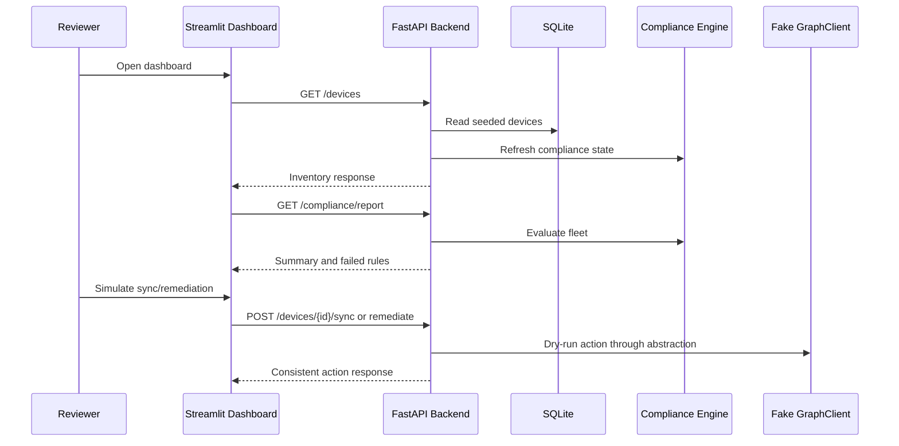

# Architecture

This project is a compact endpoint automation lab. It is intentionally local-first, but the boundaries mirror how a real Azure/Intune automation service could evolve.

## Design Goals

- Keep the demo runnable with `docker compose up`.
- Avoid real tenant credentials in the default path.
- Separate API routes, business logic, fake Graph integration, and persistence.
- Keep compliance rules testable without FastAPI, SQLAlchemy, or cloud dependencies.
- Show Azure infrastructure awareness without provisioning expensive resources.

## Runtime Flow

## Components

| Component | Responsibility |
| --- | --- |
| FastAPI backend | Owns HTTP API, schema validation, error responses, persistence access |
| SQLite database | Stores local demo inventory seeded from fake managed-device data |
| Compliance engine | Evaluates policy rules and returns failed rule identifiers |
| GraphClient | Interface/stub for future Microsoft Graph and Intune calls |
| Automation service | Coordinates dry-run sync and remediation recommendation workflows |
| Streamlit dashboard | Presents fleet health, filters, failed rules, and simulated actions |
| Inventory scripts | Demonstrate safe, read-only Linux and Windows inventory collection |
| Terraform | Defines a small Azure foundation for reports, telemetry, and identity |

## Backend Boundaries

Routes stay thin. They call service functions, return Pydantic response models, and avoid embedding compliance decisions directly in HTTP handlers.

The compliance engine accepts any object with the expected device attributes. This makes it usable with SQLAlchemy models, Pydantic models, or future Graph-normalized records.

The device service refreshes computed compliance state when devices are read. This keeps `/devices` consistent with `/compliance/devices` without adding background workers.

## Demo Graph Strategy

`GraphClient` reads `backend/app/fake_data/devices.json` today. In a production version, the same class boundary would handle:

- Microsoft Graph token acquisition.
- Managed device list calls.
- Pagination and retry behavior.
- Device sync actions.
- Mapping Graph fields to local schemas.

This keeps the rest of the application from depending directly on Graph API response shapes.

## Terraform Organization

The root Terraform module in `infra/azure` orchestrates common naming, tags, and module wiring. Focused child modules own resource groups of concern:

- `modules/storage`: storage account and compliance report container.
- `modules/monitoring`: Log Analytics and Application Insights.
- `modules/identity`: Entra application registration and service principal.

The module split is intentionally small. It shows organization without introducing a private module registry, remote state, or environment framework.

## Local Persistence

SQLite is used because it is easy to run locally and sufficient for the demo. Docker Compose stores the database in a named volume so seeded data persists between container restarts.

## Security Posture

The local demo is not an authenticated production API. The repository still models safer practices:

- No tenant credentials required.
- No secrets committed.
- Automation actions are dry-run only.
- Terraform outputs mark the Application Insights connection string sensitive.
- Inventory scripts are read-only.

Production hardening would add authentication, authorization, audit logging, secure secret storage, and scoped Graph permissions.
