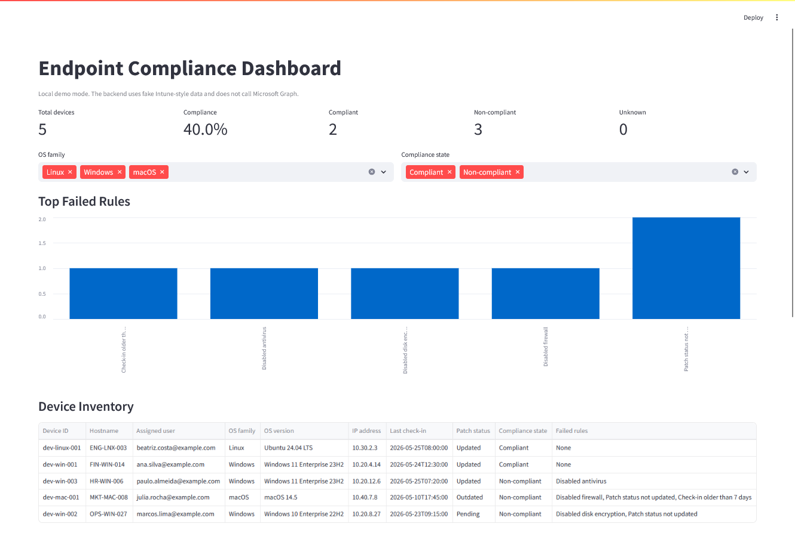
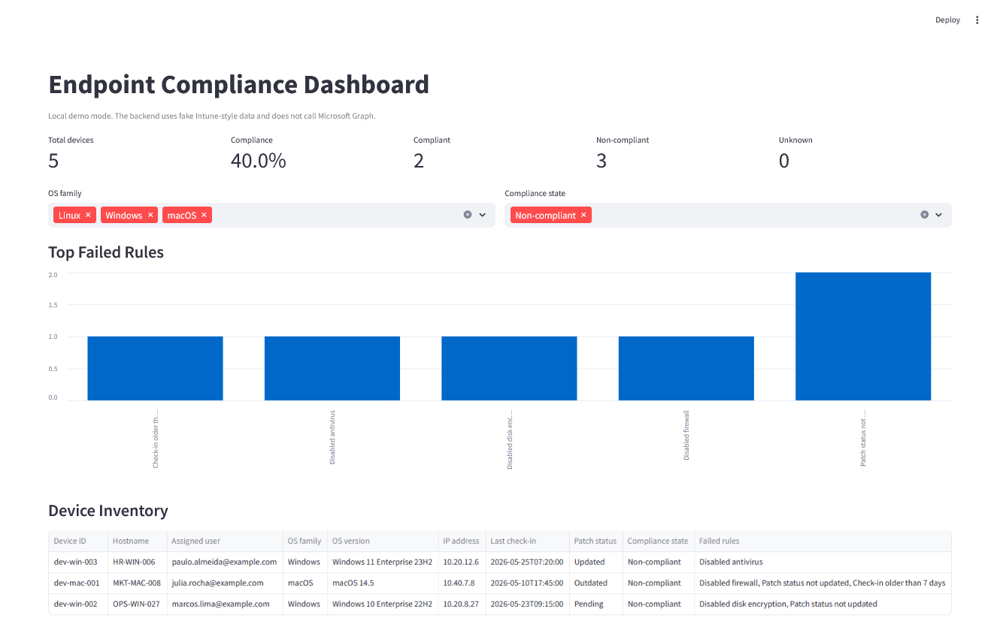
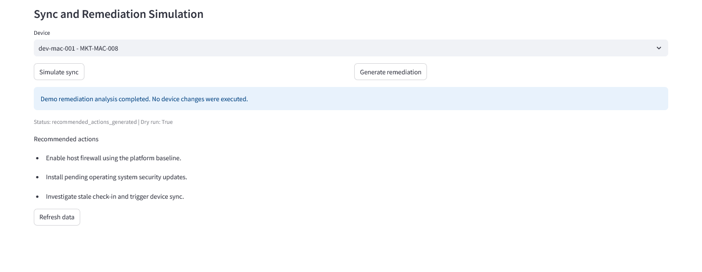
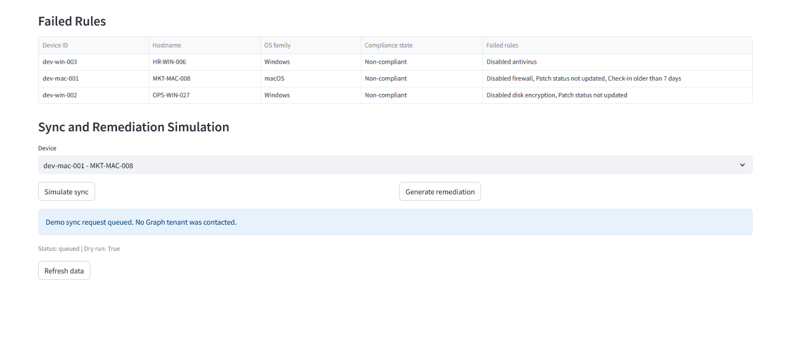
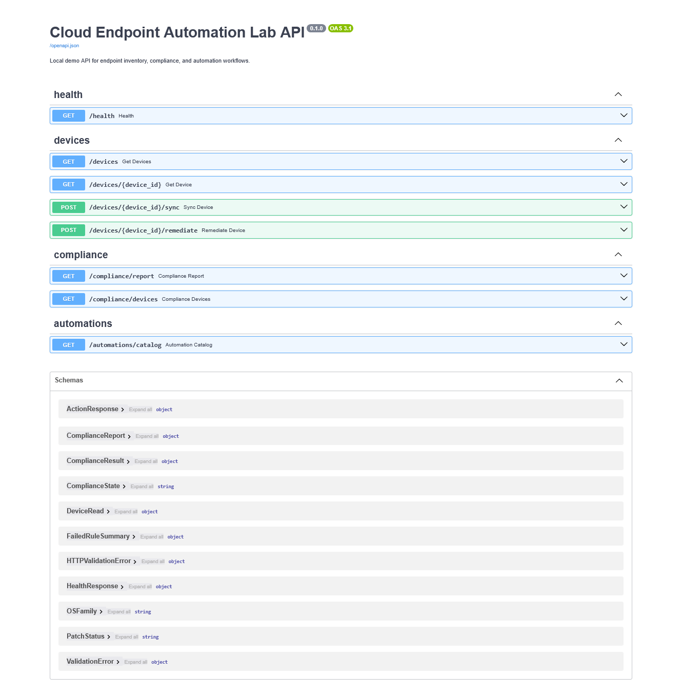
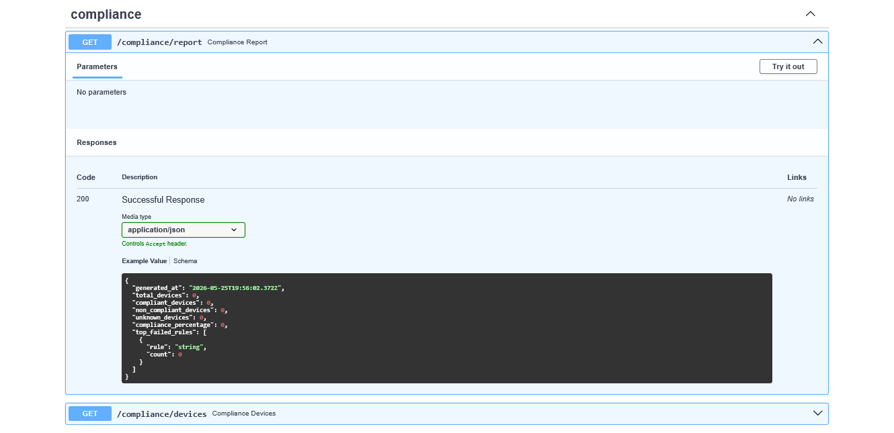
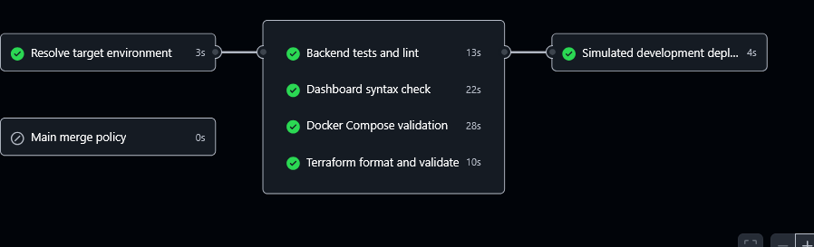

# Screenshots

This page explains the screenshots used in the README and what each one demonstrates.

## Dashboard Overview

Shows the Streamlit dashboard running locally with fleet-level compliance metrics, operating system filters, compliance-state filters, and the top failed rules chart.

## Filtered Non-Compliant Devices

Shows the dashboard filtered to non-compliant devices, highlighting how failed compliance rules can be reviewed operationally.

## Remediation Dry Run

Shows the dry-run remediation workflow. The backend generates recommended actions without making device changes.

## Device Sync Simulation

Shows the simulated Intune-style device sync action and reinforces that the project does not require a real Microsoft Graph or Intune tenant.

## FastAPI Swagger UI

Shows the API surface exposed by the FastAPI backend, including inventory, compliance, sync, and remediation endpoints.

## Compliance Report JSON

Shows the structured `/compliance/report` response with fleet totals, compliance percentage, and top failed rules.

## GitHub Actions Validation

Shows the CI workflow validating backend tests, dashboard syntax, Docker Compose, Terraform, and simulated deployment readiness.
